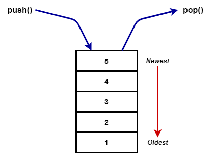

**Stack** is a linear data structure where the elements follow a _First In Last Out_ (FILO) order. It can also be thought as _Last In First Out_.



## Implementing a Stack data structure

Even though we will be implementing the **Stack** data structure in TypeScript in this example, the basic concept can be implemented in any language.

First declare a class.

```typescript
class Stack<T> {}
```

Then declare a private member variable array to store the data of the stack. Making it private will stop it from being directly accessed from outside the class.

```typescript
class Stack<T> {
  private _data: T[] = [];
}
```

Next, we need a way to check the size of the stack. We can use a getter to access the size of the `_data` array.

```typescript
class Stack<T> {
  // ...

  // Check the size of the stack
  get size(): number {
    return this._data.length;
  }
}
```

After that we'll add a method to check whether the stack is empty or not.

```typescript
class Stack<T> {
  // ...

  // Returns whether the stack is empty or not
  public isEmpty(): boolean {
    return this._data.length === 0;
  }
}
```

Now we need a method to add new elements to the stack. We can use the `push()` method in arrays to add an element to the end of the `_data` array.

```typescript
class Stack<T> {
  // ...

  // Adds an element to the top of the stack
  public push(element: T): T {
    this._data.push(element);

    return element;
  }
}
```

Finally we will implement two methods to check the element on top of the stack. One will just check the value, `peek()`, and the other will remove the element from the stack and return it, `pop()`. Both will throw an error if they are called when the stack is empty, i.e. the length of the `_data` array is zero.

```typescript
class Stack<T> {
  // ...

  // Returns the value of the element on top of the stack without removing it
  public peek(): T {
    if (this.isEmpty()) {
      throw new Error("Stack is empty");
    }

    return this._data[this._data.length - 1];
  }

  // Removes the topmost element of the stack and returns it
  public pop(): T {
    if (this.isEmpty()) {
      throw new Error("Stack is empty");
    }

    return this._data.pop() as T;
  }
}
```

Finally your stack class should look like this.

```typescript
class Stack<T> {
  private _data: T[] = [];

  // Check the size of the stack
  get size(): number {
    return this._data.length;
  }

  // Returns whether the stack is empty or not
  public isEmpty(): boolean {
    return this._data.length === 0;
  }

  // Adds an element to the top of the stack
  public push(element: T): T {
    this._data.push(element);

    return element;
  }

  // Returns the value of the element on top of the stack without removing it
  public peek(): T {
    if (this.isEmpty()) {
      throw new Error("Stack is empty");
    }

    return this._data[this._data.length - 1];
  }

  // Removes the topmost element of the stack and returns it
  public pop(): T {
    if (this.isEmpty()) {
      throw new Error("Stack is empty");
    }

    return this._data.pop() as T;
  }
}
```
