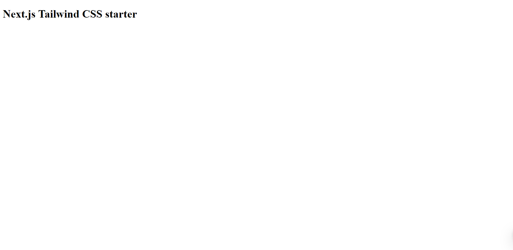
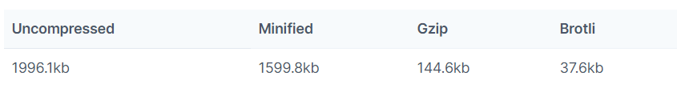
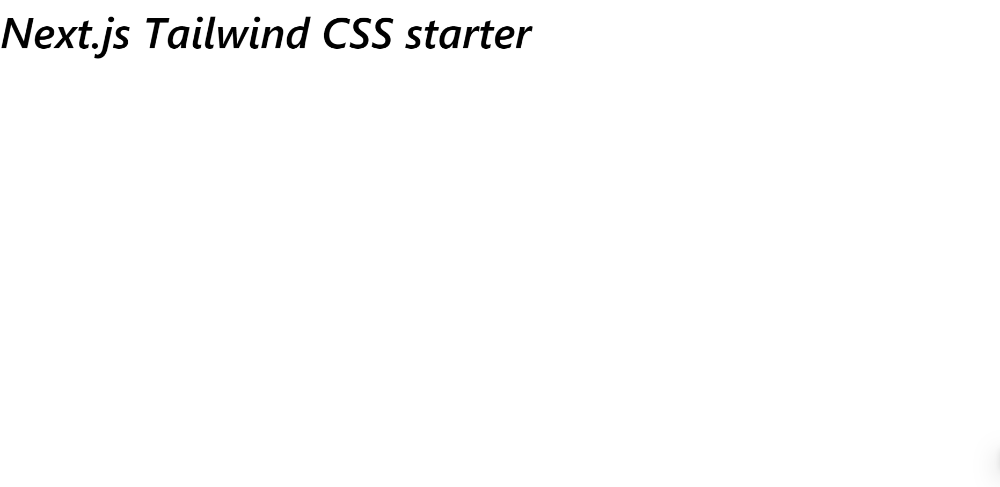
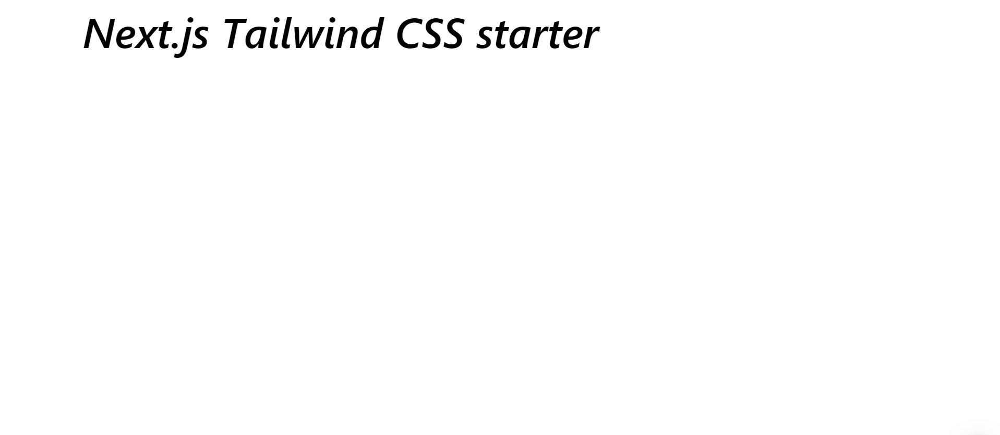

[Tailwind CSS](https://tailwindcss.com/) is an awesome CSS framework. It gives us enough styling options without being too opinionated. Lately I've being using it along with [Next.js](https://nextjs.org/). In this post I'll show how to setup a Next.js project with Tailwind CSS.

# Setting up the Next.js project

Start with initializing a project.

```bash
npm init --yes
```

Then install the React and Next.js dependencies.

```bash
npm install react react-dom next
```

Next add the following scripts in `package.json`.

```json
 "scripts": {
    "dev": "next",
    "build": "next build",
    "start": "next start"
  }
```

After that let's create a layout component to wrap all our components in all the pages. Create the `src` folder. In it create another folder called `components` and in it create `Layout.js`.

```jsx
const Layout = ({ children }) => {
  return (
    <div>
      <main>{children}</main>
    </div>
  );
};

export default Layout;
```

Next let's create the index page in out application. In the project root create the `pages` folder and in it create `index.js`.

```jsx
import Layout from "../src/components/Layout";

const Index = () => {
  return (
    <Layout>
      <h1>Next.js Tailwind CSS starter</h1>
    </Layout>
  );
};

export default Index;
```

To start the development server just run the `dev` script.

```bash
npm run dev
```

When you [`http://localhost:3000/`](http://localhost:3000/) in your browser you see the following.



# Adding Tailwind CSS

First install Tailwind CSS as a dev dependency.

```bash
npm install tailwindcss postcss-preset-env -D
```

Next we need to create the Tailwind the config file. We can create a minimal config file with the following command.

```bash
npx tailwindcss init
```

Since Tailwind CSS has thousands of CSS classes the CSS file will end up very big.



Since we will will rarely use the all classes, we should specify which classes to include the final CSS file. Fortunately Tailwind CSS has a built in [PurgeCSS](https://purgecss.com/) tool which can be used to remove all unused classes.

In the `tailwind.config.js` add all the React component files in the `purge` property. In our case we will add all files in the `pages` and `components` folders.

```javascript{2}
module.exports = {
  purge: ["./pages/**/*.js", "./src/components/**/*.js"],
  theme: {
    extend: {},
  },
  variants: {},
  plugins: [],
};
```

Next we need to create the root CSS file where we will import Tailwind CSS. In the `src` folder create the `styles` folder and it add the `index.css` file.

```css
@tailwind base;
@tailwind components;
@tailwind utilities;
```

After that we need to import the CSS to our application. In Next.js we have to do it in the `_app.js` file. Create the `_app.js` file in the `pages` folder.

```jsx
import "../src/styles/index.css";

const MyApp = ({ Component, pageProps }) => {
  return <Component {...pageProps} />;
};

export default MyApp;
```

Finally we need to setup [PostCSS](https://postcss.org/) to include Tailwind CSS. In the project root create the `postcss.config.js` file.

```jsx
module.exports = {
  plugins: ["tailwindcss", "postcss-preset-env"],
};
```

# Conclusion

That's all you need to do to start using Tailwind CSS in your Next.js project. You can style your components by adding the classes in the `className` prop.

For example, we can style the title in the index page like this.

```jsx{6}
import Layout from "../src/components/Layout";

const Index = () => {
  return (
    <Layout>
      <h1 className="text-6xl font-semibold italic">
        Next.js Tailwind CSS starter
      </h1>
    </Layout>
  );
};

export default Index;
```



We can center all the content by adding some classes to the `Layout` component.

```jsx{4}
const Layout = ({ children }) => {
  return (
    <div>
      <main className="container mx-auto">{children}</main>
    </div>
  );
};

export default Layout;
```



All the code in this post can be found in [GitHub](https://github.com/akhila-ariyachandra/tailwind-next-js-starter "
tailwind-next-js-starter").
