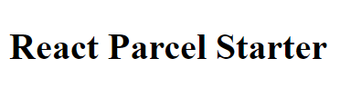

**tl;dr** - Clone and run the [source code](https://github.com/akhila-ariyachandra/react-parcel-starter "React Parcel Starter").

Usually when starting to work on a React project, developers go with **create-react-app**. While this is a great option for many cases, I find it to be a bit too bloated, especially after **ejecting** it. I also find that it takes a little of work to manually setup and maintain a **webpack** config. [Parcel](https://parceljs.org/) is great for use with React as there is nothing to configure while setting up. It also helps that building the app in Parcel is also really fast.

First lets initialize a project with either `yarn` or `npm`. I'll be using `yarn`.

```shell noLineNumbers
yarn init --yes
```

Then let's install Parcel as a dev dependency.

```shell noLineNumbers
yarn add parcel-bundler -D
```

After that let's setup **babel** by installing the dev dependencies and creating the `.babelrc` file

```shell noLineNumbers
yarn add @babel/core @babel/preset-env @babel/preset-react @babel/plugin-proposal-class-properties -D
```

Once the dependencies are done installing create the `.babelrc` file in the project root with the following code.

```json:title=.babelrc
{
  "presets": ["@babel/preset-env", "@babel/preset-react"],
  "plugins": ["@babel/plugin-proposal-class-properties"]
}
```

This is all the setup we'll need to for Parcel to work with React. Now let's setup React.
First we'll need to the React dependencies.

```shell noLineNumbers
yarn add react react-dom
```

If you want to use **_async/await_** in your code, an additional dependency is needed.

```shell noLineNumbers
yarn add @babel/polyfill
```

Next we'll need an entry point for out app. The nice thing about Parcel is that the entry file doesn't have to be a JavaScript file. In our case its going to be a HTML file.
Create a folder with the name `src`. This folder is going to contain all the source code. In the `src` folder create the `index.html` file which is going to be the entry point of the app and add the follwing code.

```html:title=src/index.html
<!DOCTYPE html>
<html lang="en">
  <head>
    <meta charset="UTF-8" />
    <meta
      name="viewport"
      content="minimum-scale=1, initial-scale=1, width=device-width, shrink-to-fit=no"
    />

    <title>React Parcel Starter</title>
  </head>

  <body>
    <div id="root"></div>
    <script src="index.js"></script>
  </body>
</html>
```

After that we'll create the `index.js` file (also in `src`) which will connect the root React component to the `index.html` file.

```jsx:title=src/index.js
import React from "react";
import ReactDOM from "react-dom";
import App from "./App.js";
import "@babel/polyfill";

ReactDOM.render(<App />, document.getElementById("root"));
```

Next let's create the root component in the `App.js` file.

```jsx:title=src/App.js
import React from "react";

const App = () => {
  return (
    <div>
      <h1>React Parcel Starter</h1>
    </div>
  );
};

export default App;
```

Finally all that's left to do is to add the scripts to run the app. Add the following in the `package.json` file.

```json:package.json {9-12}
{
  "name": "react-parcel-starter",
  "version": "1.0.0",
  "description": "A starting template for building React apps with Parcel.js",
  "main": "src/index.html",
  "repository": "https://github.com/akhila-ariyachandra/react-parcel-starter.git",
  "author": "akhila-ariyachandra <akhila_ariyachandra@live.com>",
  "license": "MIT",
  "scripts": {
    "dev": "parcel ./src/index.html",
    "build": "parcel build ./src/index.html"
  },
  "devDependencies": {
    "@babel/core": "^7.4.5",
    "@babel/plugin-proposal-class-properties": "^7.4.4",
    "@babel/preset-env": "^7.4.5",
    "@babel/preset-react": "^7.0.0",
    "parcel-bundler": "^1.12.3"
  },
  "dependencies": {
    "@babel/polyfill": "^7.4.4",
    "react": "^16.8.6",
    "react-dom": "^16.8.6"
  }
}
```

`dev` will be used to run the development of the app. Don't worry about restarting the server after making changes to the code while it's running, as Parcel will automatically take care of that. `build` is used to make the production version of the app in the `dist` folder in the project root.
Let's check if everything has been setup properly by running the `dev` command.

```shell noLineNumbers
yarn dev
```

When you visit `localhost:1234` in your browser you should be seeing



Now you can continue creating your React app as usual from here. The source code for everything done here is available in [GitHub](https://github.com/akhila-ariyachandra/react-parcel-starter "React Parcel Starter").
